# Feather-Nitrox-Analyzer

Yet _another_ nitrox analyser, but this time with an [Adafruit reverse TFT feather](https://www.adafruit.com/product/5345) so it'll be barely any work, ideally.

The feather isn't as cheap as a simple Arduino, but

- it lets me write the software in python
- it has a DAC already on board
- it has wifi on board, which I don't think I'll use, but I guess I could
- it has storage for a history of what's been analysed
- It's got a screen already set up, so I can show a bit more than one usually would
- it's got 3 buttons
- it's USB C powered, and the USB charges the LiPo battery
- It's really small

The LiPo battery

How the housing might look, super small!

A very basic screen example (the numbers are random in this picture, they're not now.)

This is an initial go at how the screens will relate to each other. An interesting constraint is that each button corresponds to an option, so unless you're chording buttons or doing long presses, a screen can't have more than 3 options. This feels very limiting, but a Perdix does a whole dive computer on 2 buttons.

```mermaid
flowchart LR
    A(Sleep) -->|wake up| B(Analyse)
    B -->|go to sleep| A
    B-->D(Callibrate)-->|done|B
    B-->|save|E(History)-->|back|B
    E-->|up|f[☝]-->E
    E-->|down|g[👇]-->E
```

