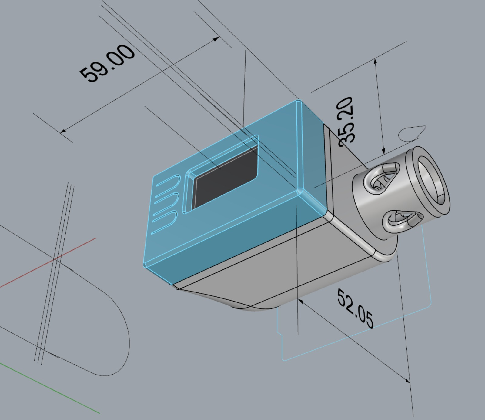

# Feather-Nitrox-Analyzer

Yet _another_ nitrox analyser, but this time with an [Adafruit reverse TFT feather](https://www.adafruit.com/product/5345) so it'll be barely any work, ideally.

## What's a nitrox analyser for?

When you're diving, you need to know what gas is in your tanks. Up to a point, more oxygen is good because it reduces the amount of nitrogen you're exposed to, but at some point that amount of oxygen becomes toxic, and can make you have a seizure which will very likely drown you.

If you've got air in your tank, it'll have roughly 21% oxygen in it, so you can dive that down to 66m with a PPO₂ of 1.6, which is fine if you're just chilling out, but if you're doing something stressful, like moving about, at all, you're better off with a PPO₂ of 1.4, which gets you to 57m.

You need to know the percentage of oxygen in your mix so that you don't go too deep for that mix. The upside is that you aren't pushing the limits of depth to 1.4 PPO₂, you get longer at a given depth if you have a richer (higher % of O₂) mix. You need to know that so you can tell your computer what to do its calculations at so that it does your calculations based on that.

## Why make an analyser?

1. It's fun to make things
2. Analysers are expensive, DIYing one is a bit cheaper
3. You can add as many features are you like
4. Making things is a way to understand why things are the way they are

## What's a Feather and why not do what everyone else has done already?

Most previous projects, e.g. [this](https://github.com/notionparallax/DIY-Nitrox-Analyzer-04_12_2019) have used an Arduino microcontroller. They're cheap, there's loads of example projects, and they've been around for a while.

There's a newer microcontroller chip than the one used in Arduinos that's a lot faster and more capable, and people have built them into some off-the-shelf prototyping boards. The feather is one of them, and it can do a lot of things:

- it lets me write the software in python
- it has a DAC already on board
- it has wifi on board, which I don't think I'll use, but I guess I could
- it has storage for a history of what's been analysed
- It's got a screen already set up, so I can show a bit more than one usually would
- it's got 3 buttons
- it's USB C powered, and the USB charges the LiPo battery
- It's really small

The LiPo battery

How the housing might look, super small!

A very basic screen example (the numbers are random in this picture, they're not now.)

This is an initial go at how the screens will relate to each other. An interesting constraint is that each button corresponds to an option, so unless you're chording buttons or doing long presses, a screen can't have more than 3 options. This feels very limiting, but a Perdix does a whole dive computer on 2 buttons.

```mermaid
flowchart TD
    SLEEP -->|1 wake| ANALYSE
    SLEEP -->|1 wake| ANALYSE
    ANALYSE -->|1 Calibrate| CALIBRATE
    ANALYSE -->|2 History| HISTORY
    ANALYSE -->|3 Sleep| SLEEP
    HISTORY -->|2 Analyse| ANALYSE
    CALIBRATE -->|1 Analyse| ANALYSE
    CALIBRATE -->|2 Analyse| ANALYSE
    CALIBRATE -->|3 Analyse| ANALYSE
    HISTORY -->|1 scroll_up|HISTORY_up["👆"]  -->HISTORY
    HISTORY -->|3 scroll_down| HISTORY_down["👇"]-->HISTORY
```

**TODO:**

[ ] Add in calibration modes

## Things it's missing, hardware wise

- It doesn't have a Real Time Clock (RTC) so the history can't have a time stamp.
- It would make the UI a lot easier to design if it had a rotary encoder to scroll between options.
- Big stretch: it'd be good to put a Carbon Monoxide (CO) monitor in there too, but that'd bump up the size a fair bit.
